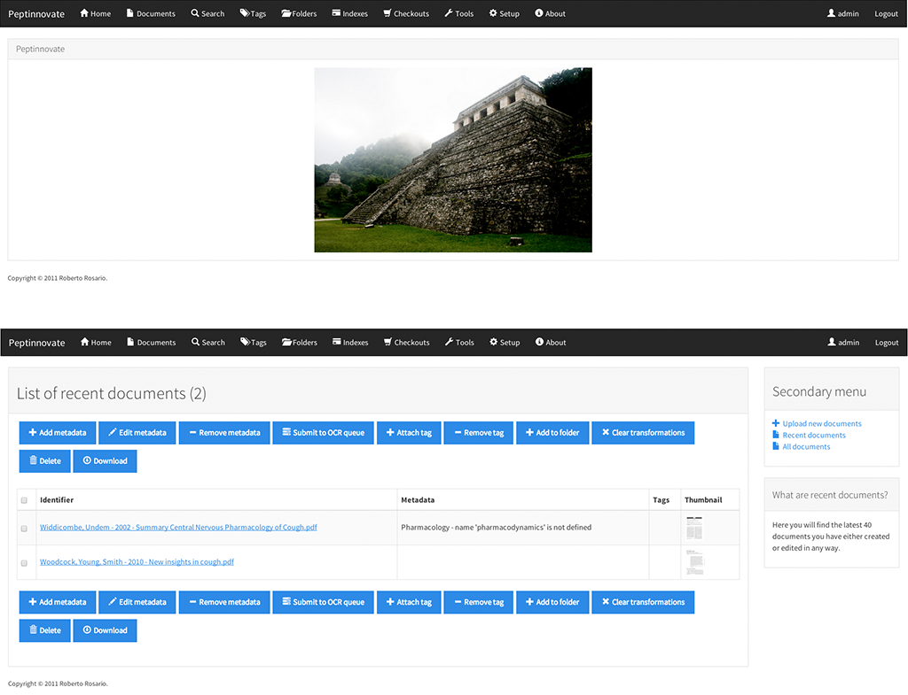

=============
Customization
=============

The general appearance of **Mayan EDMS** can be customized entirely just
by changing a few settings.

------
Themes
------

Web Theme
---------

**Mayan EDMS** defaults to using `Andrea Franz's excellent web app template`_, which includes
several themes that could be used to adapt **Mayan EDMS**'s appearance to match
an organtization existing applications' look and feel.

The theme can be changed very easily by setting the :setting:`WEB_THEME_THEME`
configuration option to one of its valid values.

.. image:: ../_static/themes.png
 :alt: themes

Login screen
~~~~~~~~~~~~

The amount of information presented at the login screen can also be restricted
for security or design reasons using :setting:`WEB_THEME_VERBOSE_LOGIN`
configuration option.

.. image:: ../_static/mayan-login.png
 :alt: mayan login screen

Home screen
~~~~~~~~~~~

Sometimes users just want to go directly to work and not just be greeted with
a home screen. For these kind of situations **Mayan EDMS** has the
:setting:`MAIN_DISABLE_HOME_VIEW` configuration option, which will cause
users to land on their ``recent document list`` as soon as they log in.

Icons
~~~~~

Some themes such as ``default`` might be more visually appealing to some
people without the menu icons, for this **Mayan EDMS** provides the
:setting:`MAIN_DISABLE_ICONS` configuration option.

.. image:: ../_static/no-icons.png
 :alt: mayan screens with out icons

.. _`Andrea Franz's excellent web app template`: https://github.com/pilu/web-app-theme

Twitter Bootstrap
-----------------

**Mayan EDMS** can use the popular Twitter Bootstrap theme instead. It makes
use of the excellent `django-bootstrap3 <https://github.com/dyve/django-bootstrap3>`_
app.

Installation
~~~~~~~~~~~~

Add ``bootstrap3`` and ``bootstrap_theme`` to installed applications ...

.. code-block:: python

    INSTALLED_APPS = (
        ...
        'django.contrib.comments',
        'django.contrib.staticfiles',
        # Themes
        'bootstrap3', # <-- needs to go just after the core django apps
        'bootstrap_theme',
        # 3rd party
        'south',
        'rest_framework_swagger',
        'filetransfers',
        ...
    );

... and comment out web_theme as they will clash

.. code-block:: python

    # 'web_theme',

By default, the system will use the 'Cosmo' theme from `bootswatch.com <bootswatch.com>`_ but you can
select a different theme by setting the :setting:`BOOTSTRAP_THEME` variable in the settings.